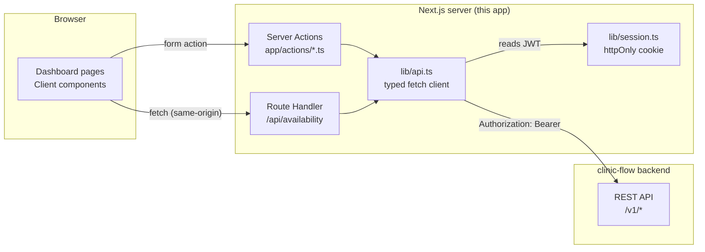

# clinic-flow-web

The frontend for [clinic-flow](https://github.com/jeferson0306/clinic-flow) — a clinic
management system. This app is the dashboard: login, patients, doctors, procedures,
appointments, a free-slot calendar, and exams. It talks to the backend exclusively
through its own server (Server Actions and Route Handlers), never from the browser —
see [Architecture](#architecture) for why.

## Stack

- **Next.js 16** (App Router, Turbopack) + **React 19** + **TypeScript** (strict)
- **Tailwind v4** — dark/light theme via CSS variables, no flash on load
- **Radix UI** primitives (dialog, tabs, tooltip) + **lucide-react** icons
- **GSAP** for entrance animations and a count-up on the dashboard's stat cards
- **react-hook-form** is available but most forms here use React 19's native
  `<form action={...}>` — a Server Action IS the submit handler, so there is no
  separate client-side validation layer to keep in sync with the backend's own
  `jakarta.validation` rules
- **Vitest** for unit tests, **Playwright** for end-to-end tests
- **i18n**: PT/EN/ES, dictionaries in `locales/*.json`, no hard-coded UI text

## Architecture



**The session JWT never reaches client-side JavaScript.** `lib/session.ts` stores it in
an `httpOnly` cookie set by the `login` Server Action; `lib/api.ts` (marked
`server-only`) is the only thing that ever reads it, attaching it to every backend
request. A page that needs backend data is a Server Component calling `lib/api.ts`
directly; a page that needs to *react* to live input (the appointment scheduler's free
slots, which change as you pick a different doctor/date) goes through
`app/api/availability/route.ts` — a thin server-side proxy so the browser can re-fetch
without ever holding the token itself. This also means there is no CORS configuration
anywhere: the browser only ever talks to this app's own origin.

`proxy.ts` (Next.js 16's rename of `middleware.ts`) gates `/dashboard/*` on the mere
*presence* of the session cookie — that's a redirect for UX, not the security boundary.
The real boundary is the backend's own `@RolesAllowed`: every Server Action still gets a
403 from the API itself if the signed-in role doesn't have it, `ApiError` carries that
back, and the UI surfaces it as a toast rather than crashing (try requesting an exam
while signed in as `admin` — that endpoint is `@RolesAllowed("DOCTOR")`).

## Running locally

You need the [clinic-flow](https://github.com/jeferson0306/clinic-flow) backend running
first — this app has no data or auth of its own.

```bash
# in ../clinic-flow
./mvnw quarkus:dev   # http://localhost:8080, needs Docker for Postgres

# in this directory
cp .env.example .env.local   # defaults already point at localhost:8080
pnpm install
pnpm dev                      # http://localhost:3000
```

Sign in with one of the backend's seeded demo accounts: `admin` / `admin123` (ADMIN, can
register patients/doctors/procedures and schedule/cancel appointments) or `doctor` /
`doctor123` (DOCTOR, can request exams and record results).

## Testing

```bash
pnpm typecheck   # tsc --noEmit
pnpm lint        # eslint . (flat config, eslint-config-next)
pnpm test        # vitest — pure functions only (validations/br.ts, lib/utils.ts), no network
pnpm test:e2e    # playwright — needs the real backend running, see above
```

Unit tests cover the Brazilian data validators/formatters (`validations/br.ts`) and
`lib/utils.ts`'s formatters — deliberately network-free so they run in CI without a
backend. `e2e/` is a real integration suite against a live backend (login, RBAC-gated
error handling, a full patient-registration flow with a freshly generated check-digit-valid
CPF so reruns don't collide with the unique constraint) — it is not wired into CI for
that reason; run it locally, or point CI at a backend if you stand one up there.

## Project structure

```
app/
  (auth)/login/          public route
  (dashboard)/dashboard/  gated by proxy.ts — patients, doctors, procedures,
                          appointments, calendar, exams, each a Server Component
                          page + a client dialog for the "create" form
  actions/                Server Actions — the only place that mutates backend state
  api/availability/       the one Route Handler (see Architecture)
components/
  ui/                     Button, Input, Select, Dialog — small, reused everywhere
  layout/                 Sidebar (collapsible, persisted), Topbar (theme/locale/logout)
  dashboard/<resource>/    resource-specific dialogs and widgets
lib/
  api.ts                  server-only typed fetch client (the ApiError class lives here)
  session.ts              httpOnly cookie helpers
  i18n.tsx / i18n-server.ts  client dictionary + server-side mirror (cookie-synced)
  types.ts                TypeScript types mirroring the backend's DTOs exactly
validations/br.ts          CPF/CNPJ/phone/CEP — client-side UX only; the backend's own
                            brdoc call is still the source of truth on every write
e2e/                        Playwright specs
```

## Deployment

Deployed on Vercel, separately from the backend (which runs on Render) — same split the
backend's own README describes for brdoc's playground. Required environment variables:

| Variable | Example |
|---|---|
| `CLINIC_FLOW_API_URL` | `https://clinic-flow.onrender.com` |
| `NEXT_PUBLIC_APP_URL` | `https://clinic-flow-web.vercel.app` |
| `NEXT_PUBLIC_APP_NAME` | `clinic-flow` |

`CLINIC_FLOW_API_URL` is read only on the server (`lib/api.ts` is `server-only`), so it
never ships to the client bundle.

## License

MIT — see [LICENSE](LICENSE).
